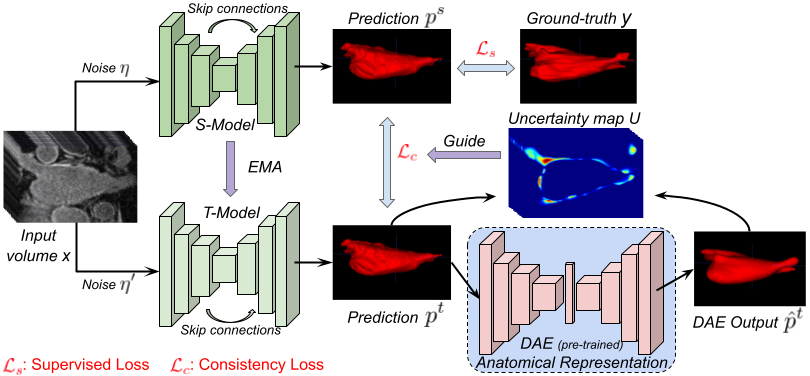

#  <p align="center"> _Anatomically-aware Uncertainty for Semi-supervised Image Segmentation_

**TL;DR:** A novel way to estimate the uncertainty maps using anatomically-aware representation prior in order to guide the segmentation model in a low-data regime.

<p align="center">  

**Keywords:** Semi-Supervised learning, Segmentation, Labeling Representation, Anatomical prior and Uncertainty


### Dependencies
This code depends on the following libraries:

- Pytorch (1.8.0+cu111)
- Python >= 3.8
- tensorboardX
- some basic libraries: numpy, glob, skimage, matplotlib, tqdm...

### Datasets
- [LA, 2018](https://github.com/yulequan/UA-MT/tree/master/data)
- [FLARE, 2021](https://flare.grand-challenge.org/FLARE21/)

### Training
The model can be trained using the below command:  
```
Coming soon...
```

### Testing
```
Coming soon...
```

### Citation
Please cite our paper if you find this code or our work useful for your research.

```
@article{adiga2022leveraging,
  title={Leveraging Labeling Representations in Uncertainty-based Semi-supervised Segmentation},
  author={Adiga V, Sukesh and Dolz, Jose and Lombaert, Herve},
  journal={MICCAI},
  year={2022}
}
```

### Reference
- Uncertainty-aware Self-ensembling Model for Semi-supervised (UAMT) [[paper](https://arxiv.org/abs/1907.07034)][[code](https://github.com/yulequan/UA-MT)]
- Semi-supervised Learning for Medical Image Segmentation (SSL4MIS) [[paper](https://arxiv.org/abs/2012.07042)][[code](https://github.com/HiLab-git/SSL4MIS/tree/master/code)]

#### Any questions?
```
For more informations, please contact Sukesh Adiga (sukesh.adiga@gmail.com).
```

#### License
This project is licensed under the terms of the MIT license. 
